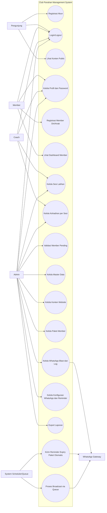

# Use Case Diagram (Markdown)

Dokumen ini memetakan use case utama sistem berdasarkan implementasi route web dan API saat ini.

## Aktor

- Pengunjung (Guest)
- Member
- Coach
- Admin
- System Scheduler/Queue
- WhatsApp Gateway

## Diagram (Mermaid)

## Relasi Use Case Penting

- UC06 Lihat Dashboard Member bergantung pada data UC12 Kelola Paket Member dan UC08 Kelola Kehadiran per Sesi.
- UC13 Kelola WhatsApp Blast dan Log memicu UC17 Proses Broadcast via Queue.
- UC14 Kelola Konfigurasi WhatsApp dan Reminder mempengaruhi perilaku UC16 Kirim Reminder Expiry Paket Otomatis.
- UC08 Kelola Kehadiran per Sesi hanya bisa dilakukan jika UC07 Kelola Sesi Latihan sudah tersedia.
